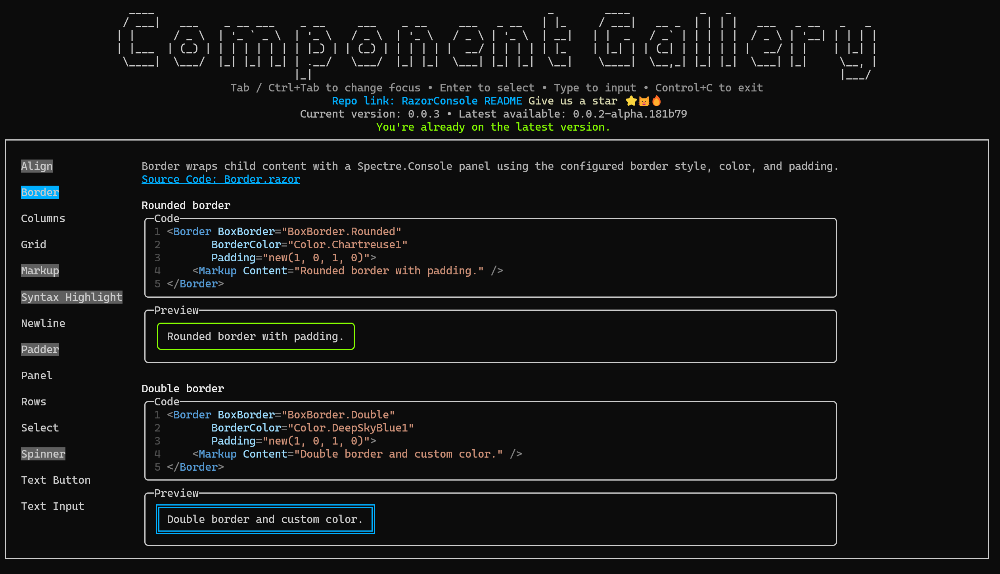

<div align="center">

# RazorConsole

[](https://www.nuget.org/packages/RazorConsole.Core)
[](LICENSE)
</div>

> Build interactive console applications with .NET Razor and Spectre.Console

## Install

```bash
dotnet add package RazorConsole.Core
```

## Usage
```csharp
// Counter.razor
@using Microsoft.AspNetCore.Components
@using Microsoft.AspNetCore.Components.Web
@using RazorConsole.Components

<Columns>
    <p>Current count</p>
    <Markup Content="@currentCount.ToString()" Foreground="@Spectre.Console.Color.Green" />
</Columns>
<TextButton Content="Click me"
            OnClick="IncrementCount"
            BackgroundColor="@Spectre.Console.Color.Grey"
            FocusedColor="@Spectre.Console.Color.Blue" />


@code {
    private int currentCount = 0;
    private void IncrementCount()
    {
        currentCount++;
    }
}

// Program.cs
await AppHost.RunAsync<Counter>();
```


## Features

### Keyboard Events
RazorConsole supports full keyboard event handling including `onkeydown`, `onkeypress`, `onkeyup`, and `oninput`. Use Tab to navigate between focusable elements and Enter to activate buttons.

### Mouse Events (Experimental)
Mouse input support is available for terminals that support it. To enable mouse events:

```csharp
var app = AppHost.Create<MyComponent>(builder =>
{
    builder.Configure(options =>
    {
        options.EnableMouseInput = true;
    });
});
await app.RunAsync();
```

**Note:** Mouse support requires platform-specific terminal capabilities:
- **Windows:** Windows Terminal or ConHost with mouse input enabled
- **Linux/macOS:** Terminal emulators supporting xterm mouse tracking (most modern terminals)

Currently, `onclick` events are triggered by pressing Enter on focused elements. Native mouse click support is under development. See [design-doc/mouse-events.md](design-doc/mouse-events.md) for details.

## Component Gallery

Explore the built-in components interactively with the RazorConsole Component Gallery. Install the tool globally and launch it from any terminal:

```bash
dotnet tool install --global RazorConsole.Gallery --version 0.0.2-alpha.181b79
```

After installation, run `razorconsole-gallery` to open the showcase and browse component examples rendered in the console. The gallery includes quick links back to this README for more details.



## Community & support

- File issues using the GitHub **Issues** tab.

## License

This project is distributed under the MIT License. See [`LICENSE`](LICENSE) for details.
